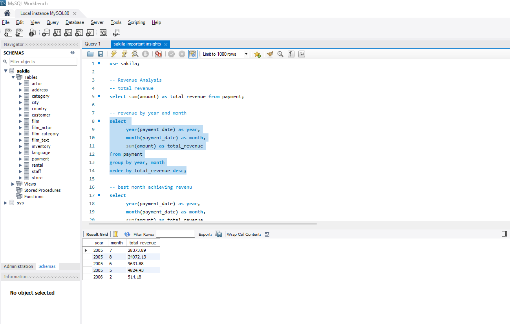
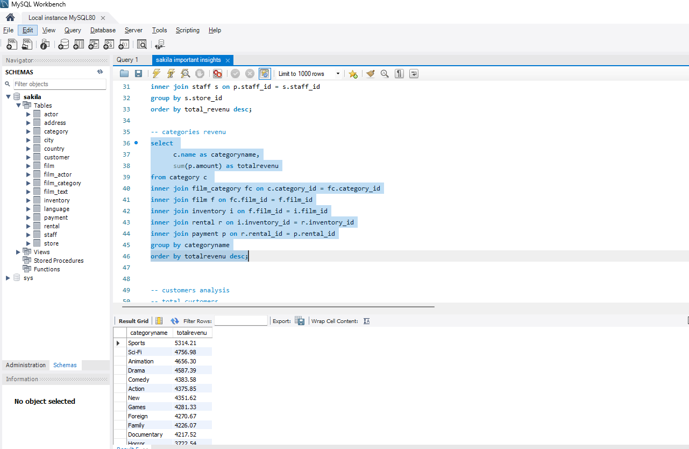
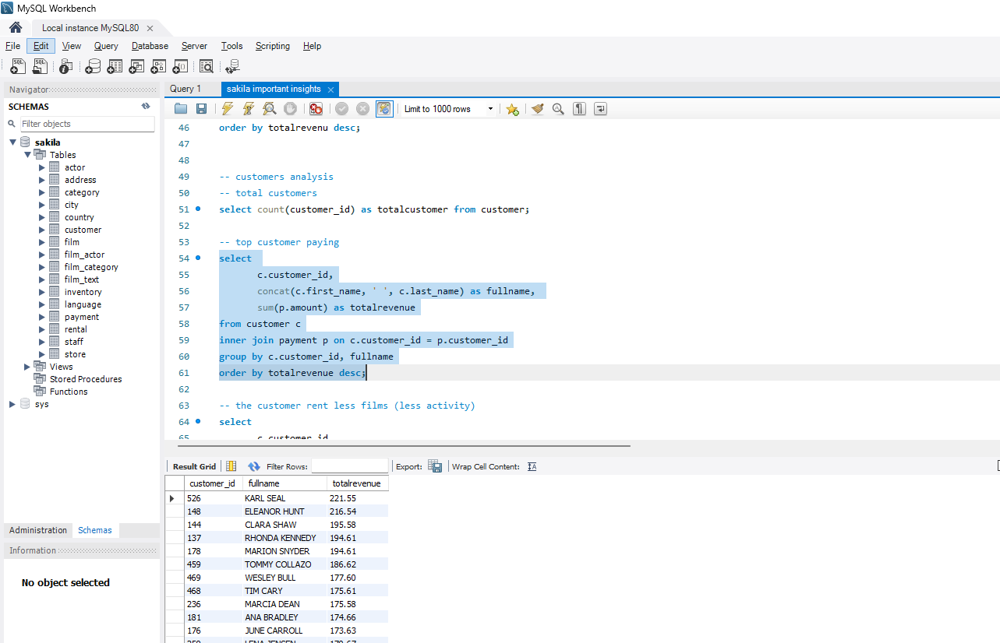
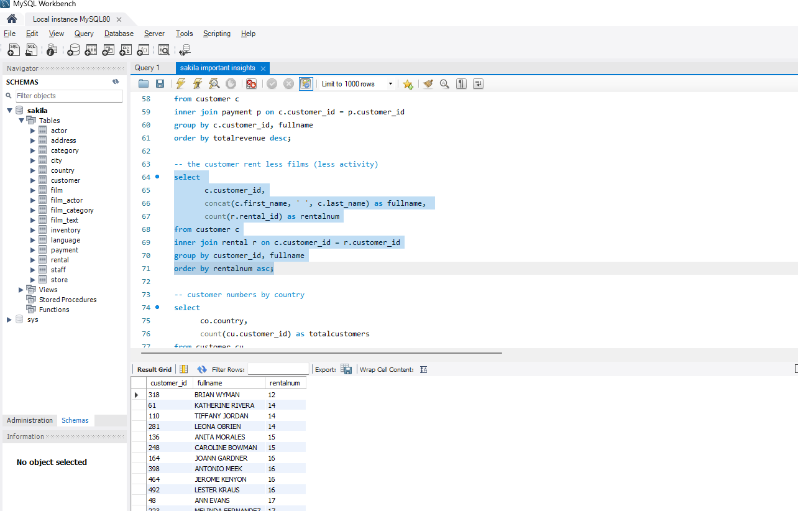
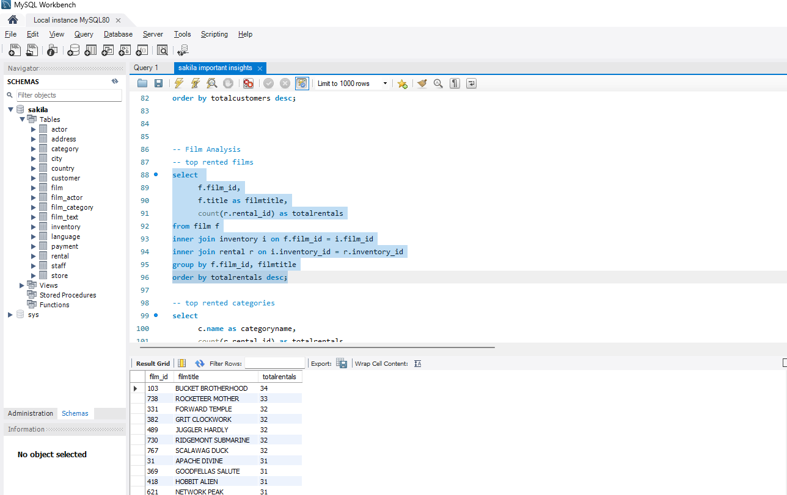
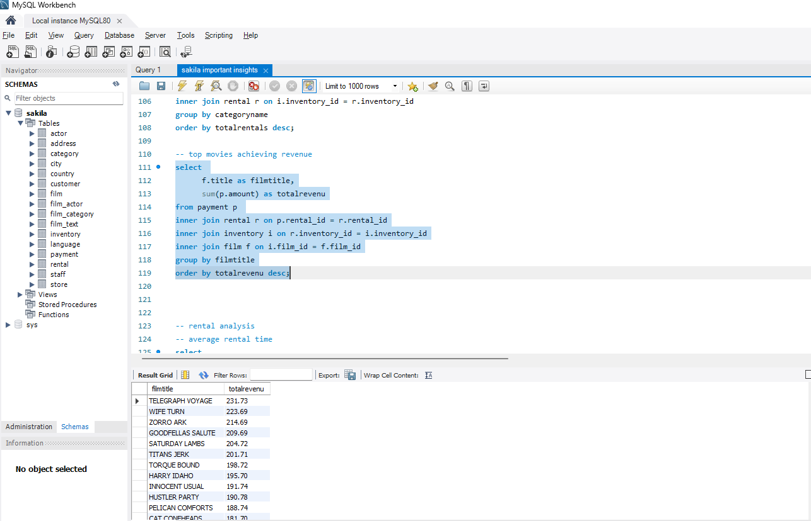
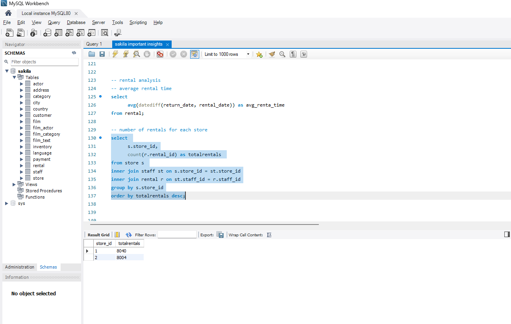
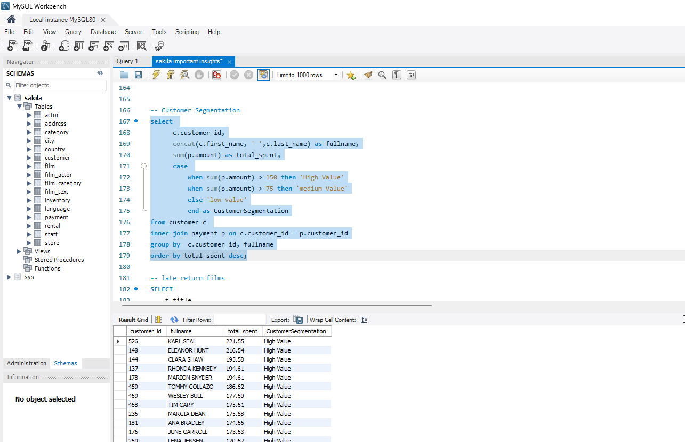
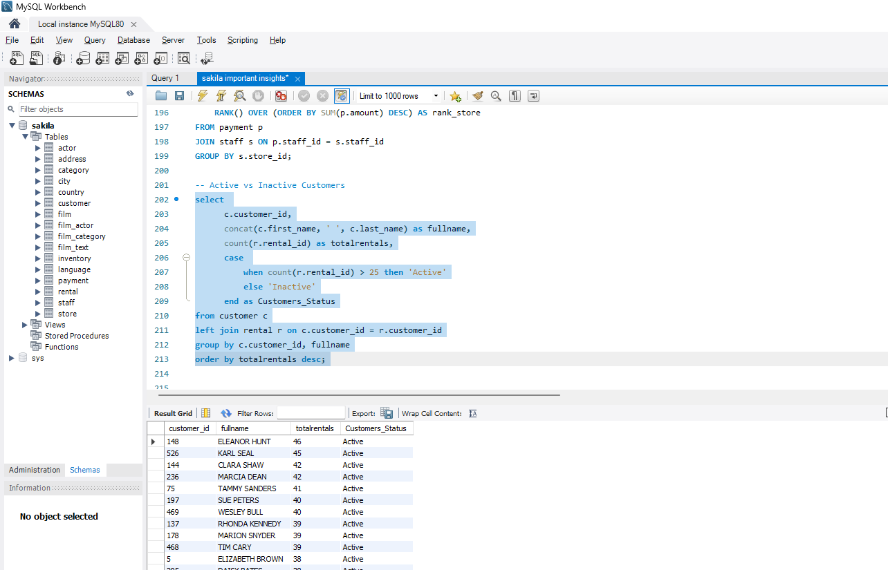

# 🎬 Sakila DVD Rental — SQL Business Intelligence

> A comprehensive SQL analysis project on the Sakila sample database using MySQL Workbench — covering 6 business domains: Revenue, Customers, Films, Rentals, Staff, and Advanced Segmentation with 20+ queries.

---

## 📌 Project Overview

This project performs deep business intelligence analysis on the **Sakila DVD Rental database** — a realistic relational database with 16 tables covering films, customers, staff, stores, rentals, and payments. All queries are written in MySQL and executed in MySQL Workbench.

| Detail | Info |
|---|---|
| **Tool** | MySQL · MySQL Workbench |
| **Database** | Sakila (MySQL Sample Database) |
| **Tables Used** | payment · customer · film · rental · staff · store · category · inventory · country |
| **Query Count** | 20+ business queries |
| **Techniques** | JOINs · GROUP BY · CASE WHEN · Window Functions · Subqueries |

---

## 📊 Analysis Sections & Screenshots

### 1. Revenue Analysis — Monthly Breakdown

Revenue by year and month: **July 2005 was the best month at $28,373**. Full yearly breakdown showing seasonal peaks in summer months.

---

### 2. Revenue by Category

**Sports** leads all categories at **$5,314**, followed by Sci-Fi ($4,757) and Animation ($4,656). Drama and Comedy round out the top 5.

---

### 3. Top Paying Customers

**Karl Seal** is the highest-spending customer at **$221.55**, followed by Eleanor Hunt ($216.54) and Clara Shaw ($195.58).

---

### 4. Least Active Customers

Customers with the lowest rental count: **Brian Wyman** rented only **12 films** — useful for targeted re-engagement campaigns.

---

### 5. Top Rented Films

**Bucket Brotherhood** leads with **34 rentals**, followed by Rocketeer Mother (33) and multiple films tied at 32 rentals.

---

### 6. Top Revenue-Generating Films

**Telegraph Voyage** is the highest revenue film at **$231.73**, followed by Wife Turn ($223.69) and Zorro Ark ($214.69).

---

### 7. Rental Analysis by Store

Both stores are nearly equal: **Store 1 with 8,040 rentals** vs Store 2 with 8,004 — almost perfectly balanced operations.

---

### 8. Customer Segmentation (CASE WHEN)

Customers classified into **High Value** (>$150), **Medium Value** (>$75), and **Low Value** tiers. Top customers all fall in High Value — Karl Seal leads at $221.55.

---

### 9. Active vs Inactive Customers

Customers flagged as **Active** (>25 rentals) or **Inactive**. Eleanor Hunt leads with **46 rentals**, Karl Seal at 45 — both clearly Active.

---

## 💡 Key Insights

- 💰 **Best month: July 2005** — $28,373 in revenue (peak summer season)
- 🏆 **Sports** is the top revenue category at $5,314
- 👤 **Karl Seal** is the top customer at $221.55 total spend
- 🎬 **Bucket Brotherhood** is the most rented film with 34 rentals
- 🏪 **Both stores** are nearly equal in rentals (~8,000 each) — well-balanced operations
- ⏱️ **Average rental duration**: calculated using `DATEDIFF(return_date, rental_date)`
- 🔴 **Late returns** identified per film — useful for inventory and penalty policy
- 📊 **Window function** `RANK() OVER` used to rank stores by revenue

---

## 🛠️ SQL Techniques Used

| Technique | Usage |
|---|---|
| `INNER JOIN` / `LEFT JOIN` | Linking payment, rental, customer, film, store tables |
| `GROUP BY` + `ORDER BY` | Aggregating revenue, rentals, and quantities |
| `CASE WHEN` | Customer segmentation & Active/Inactive classification |
| `RANK() OVER` | Window function for store ranking |
| `DATEDIFF()` | Calculating rental duration and late returns |
| `CONCAT()` | Building full customer and staff names |
| `SUM()`, `COUNT()`, `AVG()` | Core aggregation functions |

---

## 📁 Files in This Repo

| File | Description |
|---|---|
| `sakila_important_insights.sql` | All 20+ SQL queries with comments |
| `1.png` – `9.png` | MySQL Workbench screenshots showing queries & results |

---

## 🚀 How to Run

1. Install **MySQL** and **MySQL Workbench**
2. Download and install the [Sakila sample database](https://dev.mysql.com/doc/sakila/en/)
3. Open `sakila_important_insights.sql` in MySQL Workbench
4. Run queries section by section or all at once

---

## 👤 Author

**Belal Farrag** — Data Analyst

